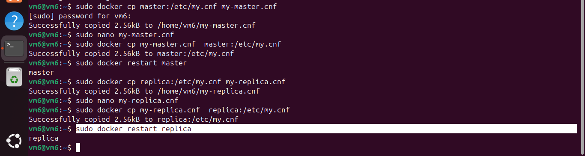

# Домашнее задание к занятию "Репликация и масштабирование. Часть 1" - Tarkov Viktor


### Инструкция по выполнению домашнего задания

   1. Сделайте `fork` данного репозитория к себе в Github и переименуйте его по названию или номеру занятия, например, https://github.com/имя-вашего-репозитория/git-hw или  https://github.com/имя-вашего-репозитория/7-1-ansible-hw).
   2. Выполните клонирование данного репозитория к себе на ПК с помощью команды `git clone`.
   3. Выполните домашнее задание и заполните у себя локально этот файл README.md:
      - впишите вверху название занятия и вашу фамилию и имя
      - в каждом задании добавьте решение в требуемом виде (текст/код/скриншоты/ссылка)
      - для корректного добавления скриншотов воспользуйтесь [инструкцией "Как вставить скриншот в шаблон с решением](https://github.com/netology-code/sys-pattern-homework/blob/main/screen-instruction.md)
      - при оформлении используйте возможности языка разметки md (коротко об этом можно посмотреть в [инструкции  по MarkDown](https://github.com/netology-code/sys-pattern-homework/blob/main/md-instruction.md))
   4. После завершения работы над домашним заданием сделайте коммит (`git commit -m "comment"`) и отправьте его на Github (`git push origin`);
   5. Для проверки домашнего задания преподавателем в личном кабинете прикрепите и отправьте ссылку на решение в виде md-файла в вашем Github.
   6. Любые вопросы по выполнению заданий спрашивайте в чате учебной группы и/или в разделе “Вопросы по заданию” в личном кабинете.
   
Желаем успехов в выполнении домашнего задания!
   
### Дополнительные материалы, которые могут быть полезны для выполнения задания

1. [Руководство по оформлению Markdown файлов](https://gist.github.com/Jekins/2bf2d0638163f1294637#Code)

---

### Задание 1

На лекции рассматривались режимы репликации master-slave, master-master, опишите их различия.

*Ответить в свободной форме.*

Репликация — это процесс, под которым понимается копирование данных из одного источника на другой или на множество других и наоборот.
С точки зрения базы данных, это механизм копирования базы данных и создания копий или дополнений существующих объектов.

Репликация типа *master-slave* часто используется для обеспечения отказоустойчивости приложений. Кроме этого, она позволяет распределить нагрузку на базу данных между несколькими серверами, или репликами.
Master — это основной сервер БД, куда поступают все данные. Все изменения в данных — добавление, обновление, удаление — должны происходить на этом сервере.
Slave — это вспомогательный сервер БД, который копирует все данные с мастера. С этого сервера следует читать данные. Таких серверов может быть несколько.

Репликация *master-master* позволяет копировать данные с одного сервера на другой. Эта конфигурация добавляет избыточность и повышает эффективность при обращении к данным.
Master-master репликации — это настройка обычной master-slave репликации, только в обе стороны, каждый сервер является мастером и слейвом одновременно.

---

### Задание 2

Выполните конфигурацию master-slave репликации, примером можно пользоваться из лекции.

*Приложите скриншоты конфигурации, выполнения работы: состояния и режимы работы серверов.*

**Установка docker ubuntu**

```python
sudo apt-get install ca-certificates curl
sudo install -m 0755 -d /etc/apt/keyrings
sudo curl -fsSL https://download.docker.com/linux/ubuntu/gpg -o /etc/apt/keyrings/docker.asc
sudo chmod a+r /etc/apt/keyrings/docker.asc

echo \
  "deb [arch=$(dpkg --print-architecture) signed-by=/etc/apt/keyrings/docker.asc] https://download.docker.com/linux/ubuntu \
  $(. /etc/os-release && echo "${UBUNTU_CODENAME:-$VERSION_CODENAME}") stable" | \
  sudo tee /etc/apt/sources.list.d/docker.list > /dev/null
sudo apt-get update
sudo apt-get install docker-ce docker-ce-cli containerd.io docker-buildx-plugin docker-compose-plugin

docker --version
sudo systemctl status docker
sudo docker run hello-world
```

**Установка и настройка docker и my-sql серверов**

```python
sudo docker run -d --name master -e MYSQL_ALLOW_EMPTY_PASSWORD=sql mysql:8.4
sudo docker run -d --name replica -e MYSQL_ALLOW_EMPTY_PASSWORD=sql mysql:8.4
sudo docker network create replication
sudo docker network connect replication replica
sudo docker network connect replication master
```


```python
sudo docker cp master:/etc/my.cnf my-master.cnf
sudo nano my-master.cnf
sudo docker cp my-master.cnf  master:/etc/my.cnf
sudo docker restart master
sudo docker cp replica:/etc/my.cnf my-replica.cnf
sudo nano my-replica.cnf
sudo docker cp my-replica.cnf  replica:/etc/my.cnf
sudo docker restart replica
```




```python
sudo docker exec -it master mysql
CREATE USER 'replica'@'%';
GRANT REPLICATION SLAVE ON *.* TO 'replica'@'%';
FLUSH PRIVILEGES;
SHOW BINARY LOG STATUS;
```


```python
sudo docker exec -it replica mysql
CHANGE REPLICATION SOURCE TO SOURCE_HOST='master', SOURCE_USER='replica', RELAY_LOG_POS=773;
START REPLICA;
SHOW REPLICA STATUS\G;
SELECT @@global.read_only;
#if 1 = replica
```


...

...
```python
#master
CREATE DATABASE mir;
USE mir; 
CREATE TABLE love (id INT NOT NULL AUTO_INCREMENT, name VARCHAR(255), PRIMARY KEY(id));
SHOW TABLES;
```


```python
#replica
SHOW DATABASES;
```


---
